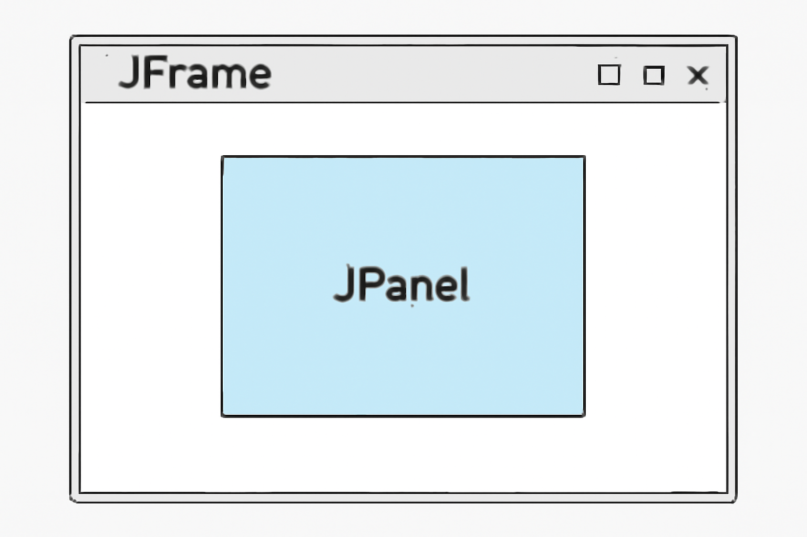

# Swing 구현

## 학습 목표

- Java Swing을 활용해 **그래픽 기반 GUI 애플리케이션**을 설계하고 구현한다.
- **이벤트 기반 프로그래밍**을 이해하고, 사용자 입력(키보드/마우스)에 반응하는 구조를 만든다.
- 공통 클래스(`GameWindow`)를 통해 **객체지향적 구조와 코드 재사용성**을 높인다.

---

## Swing 기본 구조

Swing의 기본 구조는 크게 컨테이너(Container), 컴포넌드(Component), 그리고 레이아웃(Layout)으로 나눠진다.

### 1. 컨테이너 (Container)

컨테이너는 다른 컴포넌트들을 **담고 관리**하는 역할을 한다. `JFrame`이라는 최상위 컨테이너를 사용하여 애플리케이션 창을 만든다.

- **JFrame:** 애플리케이션의 **기본 창**을 만드는 클래스이다. 가장 바깥 창이 `JFrame`이 된다.
- **JPanel:** 하나의 **부분적인 컨테이너**로, 여러 UI 컴포넌트를 포함할 수 있는 영역을 만든다. `JFrame` 안에 여러 개의 `JPanel`을 배치하여 UI를 세분화할 수 있다.

ex)
```angular2html
JFrame frame = new JFrame("Game Window");
frame.setSize(600, 600); // 창의 크기 설정
frame.setDefaultCloseOperation(JFrame.EXIT_ON_CLOSE); // 창을 닫을 때 애플리케이션 종료
frame.setVisible(true); // 창을 보이게 설정
```



### 2. 컴포넌트 (Component)

컴포넌트는 **GUI를 구성하는 기본 요소**로, 사용자와의 상호작용을 담당한다. 컴포넌트는 버튼, 텍스트 필드, 레이블 등 다양한 UI 요소들을 말한다.

- **JButton:** 버튼 컴포넌트. 클릭 이벤트를 처리할 수 있다.
- **JLabel:** 텍스트나 이미지를 표시하는 컴포넌트.
- **JTextField:** 사용자가 텍스트를 입력할 수 있는 필드.
- **JCheckBox, JRadioButton:** 체크박스나 라디오 버튼과 같은 선택 UI를 제공한다.

ex)
```angular2html
JButton startButton = new JButton("Start Game");
JLabel scoreLabel = new JLabel("Score: 0");
```

### 3. 레이아웃 (Layout)

레이아웃은 컴포넌트가 **어떻게 배치**될지를 결정하는 방식이다.

- **FlowLayout:** 컴포넌트를 **왼쪽에서 오른쪽으로, 위에서 아래**로 순차적으로 배치한다. 기본적인 레이아웃이다.
- **BorderLayout:** **상, 하, 좌, 우, 중앙**의 5개 영역에 컴포넌트를 배치할 수 있다.
- **GridLayout:** 컴포넌트를 **격자 형태**로 배치한다. 지정된 행과 열 수에 맞게 컴포넌트를 배치한다.
- **BoxLayout:** 컴포넌트를 **수평 또는 수직**으로 배치한다.

ex)
```angular2html
frame.setLayout(new FlowLayout());
frame.add(startButton);
frame.add(scoreLabel);
```

### 4. 이벤트 처리

Swing에서 사용자의 입력에 반응하려면 **이벤트 처리**가 필요하다. 이벤트는 사용자가 버튼을 클릭하거나, 키를 누르는 등의 동작을 의미한다.

- **ActionListener:** 버튼을 클릭하거나 특정 동작을 했을 때 이벤트를 처리한다.
- **KeyListener:** 키보드 입력을 처리한다.
- **MouseListener:** 마우스 클릭이나 드래그 등 마우스 이벤트를 처리한다.

ex)
```angular2html
startButton.addActionListener(new ActionListener() {
    @Override
    public void actionPerformed(ActionEvent e) {
        System.out.println("Game Started!");
    }
});
```

---

## 기능 목록

### 📌 GameBoxFrame

- [x] 프레임 기본 세팅을 한다.
    - [x] 창 사이즈 (사이즈는 사용자가 조절할 수 없음)
    - [x] 프레임 레이아웃 설정
        - [x] GridLayout으로 패널 2개를 위아래로 배치한다.
- [x] 프레임에 패널을 추가한다.

### 📌 Panel

- `BackgroundPanel`
    - [x] 텍스트를 추가한다.
        - title: 게임 제목
        - selectGame: "게임을 선택하세요."
    - [x] 패널 레이아웃 설정 ➡ GridLayout
    - [x] 텍스트들을 패널에 추가한다.
- `GameButtonPanel`
    - [x] 패널 레이아웃 설정 ➡ null (Component들의 사이즈와 위치를 직접 지정)
    - [x] 버튼을 추가한다.
        - 2048
        - 같은 그림 찾기
    - [x] 버튼의 사이즈와 위치를 설정한다.
    - [x] 패널에 버튼을 추가한다.
- `MainPanel`
    - [x] 패널 레이아웃 설정 ➡ BorderLayout
    - [x] 상단에 BackgroundPanel 추가
    - [x] 중앙에 contentPanel 추가
    - [x] 초기 화면으로 GameButtonPanel을 contentPanel에 추가
    - [x] 버튼 클릭 시 contentPanel 교체 가능

### 📌 Listener

- [x] 사용자가 원하는 게임을 누르면 해당 게임으로 이동한다.
- [x] 게임 화면에서 홈 화면으로 돌아가는 기능을 추가한다.
    - [x] "홈" 버튼 추가
    - [x] 버튼 클릭 시 contentPanel을 초기 상태로 복원


- [x] 각 게임의 보드를 그리드로 생성한다.
    - [x] 2048: 4x4 그리드
    - [x] 같은 그림 찾기: 4x4 / 6x6 / 8x8

### 📌 출력기

- [ ] 각 게임마다 점수를 표시한다.
- [ ] 게임이 종료되면 결과 메세지를 표시한다.
- [ ] 예외 상황이 발생할 경우 에러 메세지를 표시한다.

### 📌 기타 UI 기능

- [ ] 각 게임의 입력을 클릭 또는 키보드 이벤트로 처리한다.
- [ ] 게임 종료 후 새 게임 시작 버튼을 통해 게임 초기화가 가능하다.
    - [ ] 게임 보드와 점수를 초기 상태로 되돌린다.


